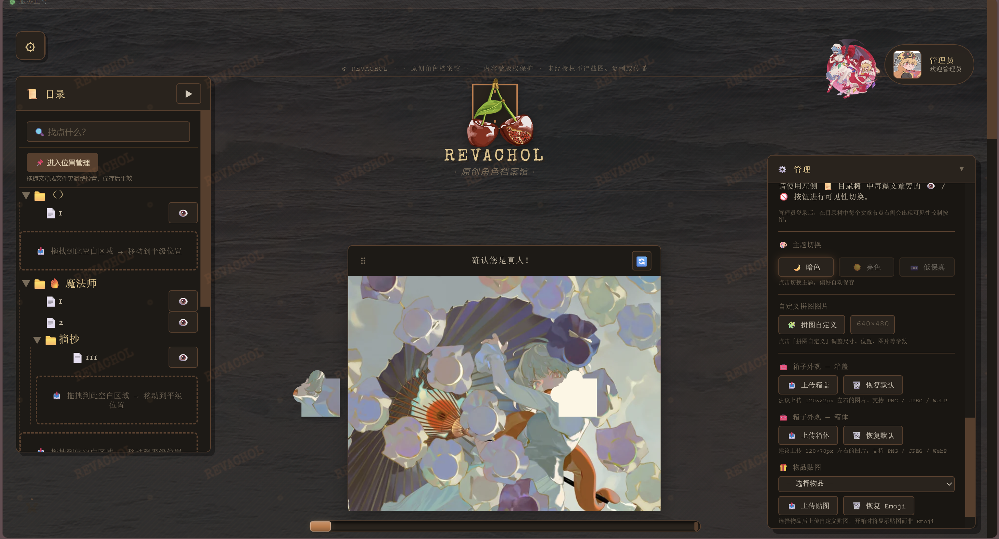
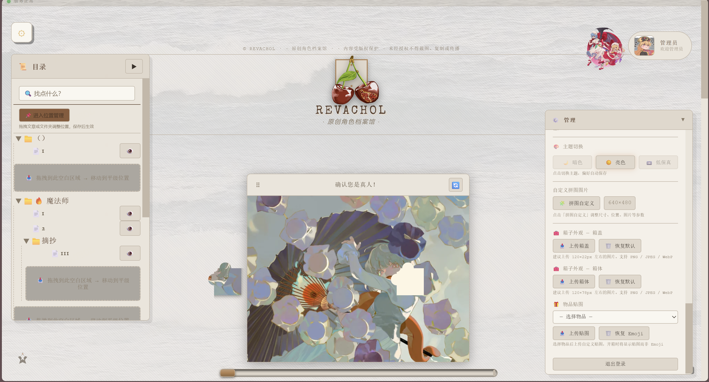
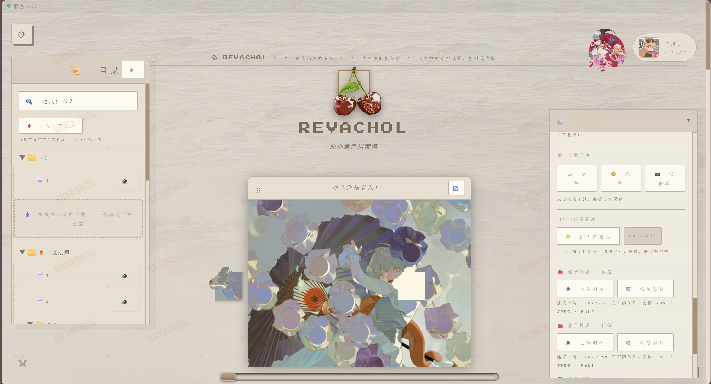
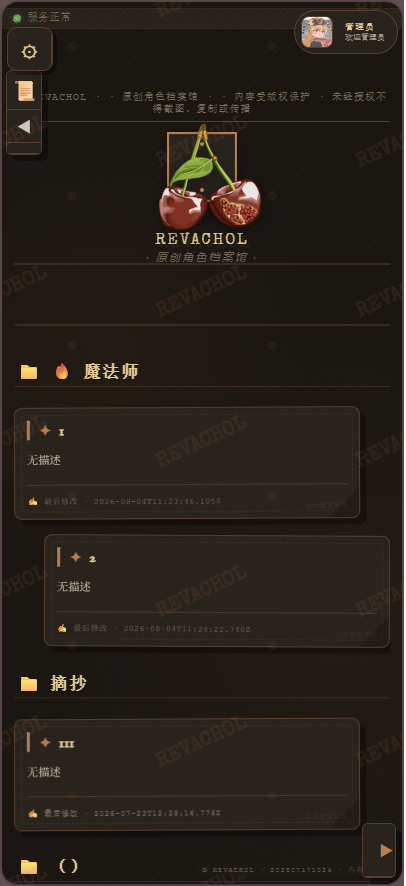

# 📚 REVACHOL

> 原创角色档案馆 —— 一个带内容管理、贴纸装饰、水印保护、多主题切换的 Web 应用。

> 当前版本：`v1.20.0` ⚠️ WIP（开发中）

## ✨ 预览
<!-- ===== 预览 ===== -->
<h2>预览</h2>

<h3>主题</h3>
<table>
  <tr>
    <th align="center">主题</th>
    <th align="center">截图</th>
  </tr>
  <tr>
    <td align="center">暗色</td>
    <td align="center"></td>
  </tr>
  <tr>
    <td align="center">亮色</td>
    <td align="center"></td>
  </tr>
  <tr>
    <td align="center">低保真</td>
    <td align="center"></td>
  </tr>
</table>

<h3>功能</h3>
<table>
  <tr>
    <th align="center">功能</th>
    <th align="center">截图</th>
  </tr>
  <tr>
    <td align="center">目录树</td>
    <td align="center"></td>
  </tr>
  <tr>
    <td align="center">贴纸系统</td>
    <td align="center"></td>
  </tr>
  <tr>
    <td align="center">移动端</td>
    <td align="center"></td>
  </tr>
</table>

## ✨ 核心功能

- **文章系统**：增删改查、分类管理、可见性控制、无限滚动
- **目录树**：折叠展开、拖拽排序、右键菜单、位置管理
- **贴纸装饰**：上传自动压缩为 WebP、移动/缩放统一编辑、文章内锚点定位
- **多主题**：暗色 / 亮色 / 低保真三套，CSS 变量驱动，零网络切换
- **详情页**：标签页模式、全屏、最小化
- **管理面板**：登录、头像、背景、纹理、水印、色卡
- **滑动拼图**：可配置交互组件（尺寸/图片/位置可自定义）
- **多 Agent 协作**：CrewAI 四角色流水线（规划 → 编码 → 审查 → 文档），Git MCP 集成
- **Crew Dashboard**：Web 端四 Agent 状态卡片 + 实时日志流（`/crew-dashboard.html`），替代终端 TUI

## 🚀 快速开始

```bash
# 1. 安装依赖
npm install

# 2. 启动后端（http://localhost:9999）
node backend/server.cjs

# 3. 启动前端（http://localhost:3000，另开终端）
npm run dev
```

Docker 一键部署：

```bash
docker compose up -d --build
```

## 🤖 Crew Dashboard 部署（Docker）

Crew Dashboard 已打包进后端镜像，复用现有 `docker-compose.yml` 单容器启动：

```bash
# 1. （可选）准备根环境变量，默认管理员密码 admin123
cp .env.example .env

# 2. 确保模型密钥位于 my_first_crew/.env
#    compose 已挂载 ./my_first_crew:/app/my_first_crew，脚本会自动读取其中 .env

# 3. 构建并启动
docker compose up -d --build

# 4. 访问
#    主站：           http://localhost:3000
#    Crew Dashboard： http://localhost:3000/crew-dashboard.html
```

使用流程：

1. 打开 `/crew-dashboard.html`，使用管理员账号登录（默认 `admin` / `ADMIN_PASSWORD`，可在根 `.env` 配置）
2. 在需求输入框填写任务描述（如“为贴纸系统新增旋转功能”）
3. 勾选 **dry-run** 先验证 Agent/Task 配置；确认无误后取消勾选真实执行
4. 页面通过 WebSocket 实时展示四 Agent 状态卡片、日志流、执行回放与 Token 统计
5. 执行完成后结构化输出写入宿主机 `./output/`（`*_parsed.json`）

验证命令：

```bash
docker compose ps
curl -s http://localhost:3000/api/crew/status          # 经 frontend 代理访问
docker compose exec backend node -e "require('http').get('http://localhost:9999/api/crew/status',r=>{r.resume();r.on('end',()=>process.exit(0))})"
docker compose exec backend ps -o user,pid,cmd | grep -E "node|python"   # 非 root 检查
```

注意事项：

- 容器以非 root `node` 用户运行（镜像内 `USER node`）
- `my_first_crew/.venv` 使用匿名卷保留镜像内 Linux venv，避免宿主机 Windows `.venv` 通过绑定挂载覆盖
- `my_first_crew/.env` 为密钥文件，不复制进镜像，运行时由绑定挂载提供
- `CREW_DIR` 由 compose 注入为 `/app/my_first_crew`，用于后端定位 Python 脚本（本地开发无需设置）
- Linux 宿主如遇 `./output` 写入权限不足：`sudo chown -R 1000:1000 output`

## 📦 技术栈

- 前端：原生 ES Module + Vite，自研状态管理（AppState + EventBus）
- 后端：Node.js 22 + 原生 http + sql.js（SQLite）+ WebSocket
- 存储：本地文件系统 / S3 兼容对象存储（适配器模式切换）
- AI：CrewAI 多 Agent 协作（`my_first_crew/`）
- 测试：Vitest + jsdom（单元）、Playwright（端到端）

## 📚 完整文档

- [项目总览与架构](my_first_crew/knowledge/README.md)
- [更新日志](my_first_crew/knowledge/README.md#更新日志)
- [路线图](my_first_crew/knowledge/docs/roadmap.md)
- [架构文档](my_first_crew/knowledge/docs/architecture/README.md)
- [开发指南](my_first_crew/knowledge/docs/development/)
- [部署指南](my_first_crew/knowledge/docs/development/tools/docker/README.md)
- [CrewAI 多 Agent 指南](my_first_crew/knowledge/docs/development/tools/crewai/)
- [AI 协作审计](my_first_crew/knowledge/docs/ai-collaboration/)

---

> 💡 完整的架构设计、API 文档、版本历史与开发规范请查阅 `my_first_crew/knowledge/` 目录。
