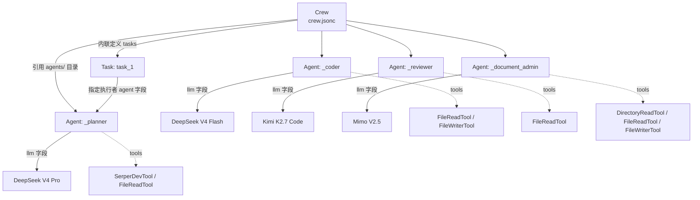
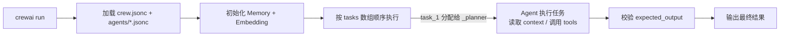
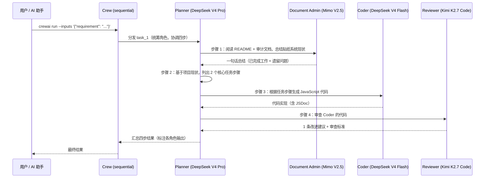

# CrewAI 多 Agent 协作 — 完整说明

> 面向需要深入理解或扩展多 Agent 系统的开发者。快速启动见 [quickstart.md](quickstart.md)。
> 项目版本：crewai 1.15.16 | 更新：2026-08-19

---

## 目录

1. [架构概述](#1-架构概述)
2. [Agent 配置详解](#2-agent-配置详解)
3. [Task 配置详解](#3-task-配置详解)
4. [记忆功能配置](#4-记忆功能配置)
5. [当前团队的协作流程](#5-当前团队的协作流程)
6. [与 LangGraph 的对比说明](#6-与-langgraph-的对比说明)
7. [扩展指南](#7-扩展指南)

---

## 1. 架构概述

### 1.1 JSON-first 结构的设计理念

CrewAI 支持两种配置方式：**Python 代码定义**（`Crew()`/`Agent()`/`Task()`）和 **JSON-first 声明式配置**。本项目采用 JSON-first：

```
配置即代码：agents/*.jsonc（Agent 定义）+ crew.jsonc（Crew 与 Task 定义）
```

- **关注点分离**：Agent 的角色/模型/工具与 Task 的执行内容分离存放，各改各的
- **低认知负担**：不需要读 Python API 文档即可增删 Agent 或 Task，AI 助手也能直接编辑
- **可审计**：模型、温度、工具、人设全部显式声明，便于评审和版本对比
- **与工具链兼容**：`pyproject.toml` 中 `[tool.crewai]` 声明 `definition = "crew.jsonc"`，`crewai run` 直接加载

> 注：JSONC = JSON with Comments，支持 `//` 注释，便于在配置中写说明（本项目大量使用）。

### 1.2 Agent / Task / Crew 三层关系



- **Agent**（`agents/*.jsonc`）：角色的"人"——定义身份（role）、目标（goal）、人设（backstory）、大脑（llm）、工具（tools）、行为（settings）
- **Task**（`crew.jsonc` 内联）：角色的"活"——定义要做什么（description）、产出什么（expected_output）、依赖什么（context）
- **Crew**（`crew.jsonc`）：编排层——引用哪些 Agent、按什么流程（process）执行、是否启用记忆（memory）

### 1.3 执行流程（`sequential` 顺序执行）



当前 `process` 为 `"sequential"`：**tasks 数组中的任务按声明顺序依次执行**。任务之间通过 `context` 字段传递上一步的产出（见 §3.2）。

---

## 2. Agent 配置详解

### 2.1 四个 Agent 的设计思路

| Agent ID | 角色 | 模型 | 定位 | 关键设计 |
|----------|------|------|------|----------|
| `_planner` | 技术规划师 | DeepSeek V4 Pro | 拆解任务、定义验收标准、协调全局 | 12 年全栈架构师人设；温度低（0.3）求严谨；配 `SerperDevTool` 可查外部资料 |
| `_coder` | 代码开发者 | DeepSeek V4 Flash | 将计划落地为具体代码 | 确定性优先（温度 0.1）；配 `FileWriterTool` 可直接写文件；要求 JSDoc 注释 |
| `_reviewer` | 代码审查员 | Kimi K2.7 Code | 审查代码正确性、安全性、可维护性 | 推理能力强的审查专家人设；配 `FileReadTool` 只读审查 |
| `_document_admin` | 文档处理员 | Mimo V2.5 | 阅读文档、提取摘要、维护知识库 | 长上下文优势；配 `DirectoryReadTool` + `FileWriterTool` 可读目录写文档 |

**设计原则**：

- **模型与角色匹配**：规划要严谨（Pro）、编码要确定（Flash）、审查要推理（Kimi）、文档要长上下文（Mimo）
- **工具最小化**：每个 Agent 只配自己需要的工具（审查员不需要写文件工具，防止越权修改）
- **人设即规范**：backstory 中写明了行为准则（如 Planner 要求"每个子任务有可验证的完成标准"，Coder 要求"代码即文档"），比在 Task 里反复强调更稳定

### 2.2 `llm` 字段的两种写法

**写法一：字符串（简写）** — 使用 CrewAI 内置 provider 约定：

```jsonc
"llm": "openai/gpt-4o"
```

格式为 `provider/model`，由 LiteLLM 路由到对应服务商，API Key 从环境变量（如 `OPENAI_API_KEY`）自动读取。

**写法二：对象（完整控制）** — 本项目实际使用：

```jsonc
"llm": {
  "model": "openai/deepseek-v4-pro",   // provider/model 格式
  "api_key": "${DEEPSEEK_PRO_API_KEY}", // ${VAR} 从 .env 读取
  "base_url": "https://api.deepseek.com/v1"  // 自定义端点（直连或中转）
}
```

**选择建议**：

- 使用官方服务商 + 默认环境变量命名 → 用字符串写法
- 使用自定义端点 / 中转服务 / 非标准环境变量名 → 用对象写法（本项目四个 Agent 均为对象写法）
- 需要 Azure 部署、Ollama 本地模型时，对象写法可扩展 `provider: "azure"` / `provider: "ollama"` 等字段

> **端点说明**：当前 Kimi 直连 `api.moonshot.cn`、Mimo 直连 `api.xiaomimimo.com`（官方端点）。如需走 4SAPI 等中转服务，只需将对应 Agent 的 `base_url` 替换为中转地址即可，模型名与 API Key 保持 `.env` 中的配置。

### 2.3 `tools` 字段：可用工具列表与选择建议

内置工具（`crewai[litellm,tools]` 附带）：

| 工具 | 用途 | 当前使用方 |
|------|------|-----------|
| `FileReadTool` | 读取本地文件内容 | 全部四个 Agent |
| `FileWriterTool` | 写入/创建本地文件 | `_coder`、`_document_admin` |
| `DirectoryReadTool` | 列出/读取目录结构 | `_document_admin` |
| `SerperDevTool` | Google 搜索（需 `SERPER_API_KEY`） | `_planner` |
| `ScrapeWebsiteTool` | 抓取网页内容 | 未使用（可选） |

自定义工具：`"custom:工具名"` 引用 `tools/工具名.py`（见 §7.3）。

**选择建议**：

- 只读类工作（审查、分析）→ 仅配 `FileReadTool`
- 产出代码/文档 → 加配 `FileWriterTool`
- 需要联网查资料 → `SerperDevTool`（需额外申请 Serper API Key）
- 避免给 Agent 用不到的工具，工具越多越容易偏离任务

### 2.4 `settings` 各参数说明

当前四个 Agent 均使用：

```jsonc
"settings": {
  "verbose": false,            // 详细执行日志：true 时打印每个步骤的 LLM 调用
  "allow_delegation": true,    // 允许委派：Agent 可将子任务交给其他 Agent（配合 Crew 内其他 Agent）
  "planning": true             // 预规划：执行 Task 前先生成逐步计划再动手
}
```

| 参数 | 类型 | 默认 | 说明 |
|------|------|------|------|
| `verbose` | boolean | `false` | 输出详细执行日志（Crew 级 `verbose: true` 与 Agent 级可叠加） |
| `allow_delegation` | boolean | `false` | 允许 Agent 把任务委派给 Crew 中其他 Agent（顺序流程中慎用，可能打乱预期顺序） |
| `planning` | boolean | `false` | 执行前先生成 step-by-step 计划，提升复杂任务完成度 |
| `max_iter` | number | `25` | 单任务最大推理轮次，防止死循环 |
| `max_tokens` | number | `null` | 单次响应最大 token 数 |
| `max_execution_time` | number | `null` | 最大执行秒数 |
| `max_rpm` | number | `null` | 每分钟最大 LLM 请求数（限流） |
| `memory` | boolean | `false` | Agent 级记忆（当前在 Crew 级开启） |
| `cache` | boolean | `true` | 缓存工具调用结果，避免重复调用 |
| `max_retry_limit` | number | `2` | 执行出错时的最大重试次数 |
| `use_system_prompt` | boolean | `true` | 是否使用 system prompt 注入角色 |

---

## 3. Task 配置详解

Task 定义在 `crew.jsonc` 的 `tasks` 数组中，一个 Task 绑定一个 Agent：

```jsonc
{
  "name": "task_1",
  "agent": "_planner",                      // 指定执行该任务的 Agent（引用 agents/ 下文件名）
  "description": "请根据项目现状，执行以下四个任务，按顺序依次完成...",
  "expected_output": "一份完整的任务执行结果，包含：文档总结、2 个核心任务步骤、一个 JavaScript 函数实现、以及审查意见。"
}
```

### 3.1 `description` 和 `expected_output` 撰写要点

**description（要做什么）**：

- 明确输入来源：如"阅读 `README.md` 和 `docs/ai-collaboration/` 目录下的审计文档"
- 明确动作边界：如"按顺序依次完成，无需征求我的确认"
- 明确每个 Agent 的职责分配：如"【文档处理员】总结…【技术规划师】列出步骤…【代码开发者】生成…【代码审查员】审查…"
- 明确输出纪律：如"每个 Agent 只回复自己被分配的部分，并在回复前标注自己的角色名"

**expected_output（交付什么）**：

- 列出产出物的**构成清单**（有、且有、且有…），如"包含：文档总结、2 个核心任务步骤、一个 JavaScript 函数实现、以及审查意见"
- 作为 Agent 完成判定的标准：Agent 会据此自我校验，输出不达标会自我修正

### 3.2 `context` 依赖关系的使用

当某个 Task 需要依赖**前序 Task 的输出**时，使用 `context` 字段引用前序 Task 的 `name`：

```jsonc
"tasks": [
  { "name": "plan", "agent": "_planner", "description": "制定计划...", "expected_output": "..." },
  {
    "name": "implement",
    "agent": "_coder",
    "context": ["plan"],                    // 将 plan 的输出作为本任务的上下文
    "description": "根据计划实现代码...",
    "expected_output": "..."
  }
]
```

要点：

- `context` 中的 Task 会**先于**当前 Task 执行（即使声明在数组后面）
- 当前示例 `task_1` 是单 Task 编排，所有分工写在一个 `description` 里由 Planner 统筹；拆成多 Task 时用 `context` 显式串联
- `context` 是"只读输入"，不会改变 `process` 的执行顺序模型

### 3.3 在 Task 中使用 `{placeholder}` 占位符

`crew.jsonc` 顶层 `inputs` 定义了运行时输入：

```jsonc
"inputs": {
  "requirement": "这是一个示例需求，请替换为实际内容。",
  "project_context": "Revachol 项目是一个原创角色档案馆..."
}
```

Task / Agent 的 `description`、`goal`、`backstory` 中均可引用：

```jsonc
"description": "请基于 {project_context}，实现需求：{requirement}"
```

运行时通过命令行传参覆盖：

```bash
crewai run --inputs '{"requirement": "为贴纸系统新增旋转功能"}'
```

> 未通过 `--inputs` 传入时，使用 `inputs` 中的默认值；未定义 `inputs` 而 Task 引用了占位符会报错。

---

## 4. 记忆功能配置

### 4.1 `memory: true` 的作用

`crew.jsonc` 顶层 `"memory": true` 启用 CrewAI 的记忆系统：

- **短期记忆**：同一 Crew 运行内保留执行上下文，供后续 Agent 引用
- **长期记忆**：跨运行持久化（存于 `~/.crewai` 本地存储），后续运行可"回忆起"之前的结果
- **实体记忆**：提取任务中的关键实体（人物/文件/模块）用于检索

> 依赖：启用记忆后 **必须** 配置 Embedding 模型，否则报错。

### 4.2 Embedding 配置方式（当前：4SAPI 中转 OpenAI 兼容接口）

`crew.jsonc` 中的 `embedder`：

```jsonc
"embedder": {
  "provider": "openai",
  "config": {
    "model": "text-embedding-3-small",
    "api_key": "${OPENAI_API_KEY}",    // 从 .env 读取
    "base_url": "${OPENAI_API_BASE}"   // 从 .env 读取
  }
}
```

对应 `.env`：

```dotenv
OPENAI_API_KEY=your_key_here
OPENAI_API_BASE=https://4sapi.org/v1      # 4SAPI 中转（OpenAI 兼容）
```

原理：`base_url` 指向 4SAPI 的 OpenAI 兼容 `/v1` 端点，模型名为 OpenAI 标准的 `text-embedding-3-small`，由中转服务转发到实际 Embedding 提供商。**只要中转端支持 OpenAI Embedding 协议，模型名可替换为任何其支持的模型。**

### 4.3 使用其他 Embedding 提供商

更换 `embedder` 的 `provider` 与 `config` 即可，无需改业务代码：

```jsonc
// 示例 1：Hugging Face
"embedder": {
  "provider": "huggingface",
  "config": { "model": "BAAI/bge-small-en-v1.5" }
}

// 示例 2：本地 Ollama
"embedder": {
  "provider": "ollama",
  "config": {
    "model": "nomic-embed-text",
    "base_url": "http://localhost:11434"
  }
}

// 示例 3：Google Vertex AI
"embedder": {
  "provider": "vertexai",
  "config": {
    "model": "text-embedding-005",
    "location": "us-central1"
  }
}
```

> 若完全不启用记忆，可将 `"memory": false` 并移除 `embedder` 配置。

---

## 5. 当前团队的协作流程

四个 Agent 在 `sequential` 流程下，通过**一个统筹 Task（`task_1`）**协作完成需求。执行链路如下：



**要点**：

- 当前采用"**单 Task + 多角色分工**"模式：`task_1` 分配给 `_planner`，由 Planner 在 description 的指示下调度其余角色
- 每个 Agent 只输出自己负责的部分，并标注角色名，便于结果可追溯
- 分工顺序：**先读文档（Document Admin）→ 再规划（Planner）→ 后编码（Coder）→ 终审查（Reviewer）**，保证"计划先行、审查兜底"
- 若未来需要更细粒度控制，可拆分为多 Task 并用 `context` 串联（见 §3.2）

---

## 6. 与 LangGraph 的对比说明

### 6.1 当前不启用 LangGraph 的原因

项目根目录原有 LangGraph 配置（`langgraph.json`、`agent.js`），已**归档至 `legacy/langgraph/`**（含 `.env.langgraph`），当前阶段不启用：

1. **需求侧重**：当前更侧重 Agent 角色的灵活编排和任务分解，CrewAI 的声明式配置（JSONC）更适配
2. **配置成本**：LangGraph 的状态机模式（节点、边、状态迁移）对本项目当前的协作复杂度而言，配置成本较高
3. **渐进评估**：待 CrewAI 团队运行稳定后，再评估 LangGraph 是否作为补充方案（如需要人工审批的节点）

### 6.2 CrewAI vs LangGraph 适用场景

| 维度 | CrewAI | LangGraph |
|------|--------|-----------|
| 抽象层次 | 角色/任务/团队（贴近业务） | 图/节点/状态（贴近底层） |
| 配置方式 | 声明式（JSONC，低门槛） | 编程式（Python 图定义） |
| 协作模型 | 多 Agent 角色分工、委派 | 显式状态机流转、条件分支 |
| 流程控制 | sequential / hierarchical 内置 | 完全自定义（循环、分支、中断） |
| 人工介入 | 有限（guardrail/回调） | 原生支持 `interrupt` 人工审批节点 |
| 适用场景 | 内容生成、审查流水线、文档处理 | 复杂工作流、需要人类确认、多条件分支 |

**选择速记**：线性协作流水线 → CrewAI；图式工作流 + 人工审批 + 复杂状态 → LangGraph。

### 6.3 未来可能的混合使用方案

```
方案 A：CrewAI 为主 + LangGraph 补充
  常规任务 → CrewAI（四个 Agent 线性协作）
  需人工审批的关键节点 → 接入 LangGraph 的 interrupt 节点

方案 B：LangGraph 编排 + CrewAI 执行
  LangGraph 定义整体状态机（分支/循环/审批）
  每个"执行单元"内部使用 CrewAI 的 Crew 完成子任务
```

当前阶段保持 CrewAI 单方案，待多 Agent 运行稳定、出现"需要人工确认/多分支"的实际需求后再引入。

---

## 7. 扩展指南

### 7.1 添加新的 Agent

1. 在 `agents/` 下创建 `_你的角色名.jsonc`（文件名即 Agent 引用 ID，下划线前缀为约定）：

```jsonc
{
  "role": "测试工程师 (Tester)",
  "goal": "1. 编写覆盖关键路径的测试用例；2. 验证代码行为符合预期。",
  "backstory": "你是一位严谨的测试工程师，擅长边界条件分析和回归测试。",
  "llm": {
    "model": "openai/deepseek-v4-flash",
    "api_key": "${DEEPSEEK_FLASH_API_KEY}",
    "base_url": "https://api.deepseek.com/v1"
  },
  "tools": ["FileReadTool", "FileWriterTool"],
  "settings": { "verbose": false, "allow_delegation": true, "planning": true }
}
```

2. 在 `crew.jsonc` 的 `"agents"` 数组中加入文件名：`["_planner", "_coder", "_reviewer", "_document_admin", "_tester"]`
3. 新建对应 Task 或并入现有 Task 分工

### 7.2 添加新的 Task

在 `crew.jsonc` 的 `tasks` 数组中追加：

```jsonc
{
  "name": "task_2",
  "agent": "_tester",
  "context": ["task_1"],                       // 依赖前序任务的输出
  "description": "为 task_1 生成的函数编写单元测试，覆盖正常与异常输入。",
  "expected_output": "一份可执行的测试文件，包含至少 3 个测试用例。"
}
```

- 顺序流程：`context` 引用的 Task 会先执行，再执行本 Task
- 无依赖的新 Task 按数组顺序在无 `context` 的 Task 之后依次执行

### 7.3 配置自定义 Tools

1. 在 `tools/` 下创建 `tools/my_tool.py`，实现 CrewAI 工具协议：

```python
from crewai.tools import tool

@tool("ReadPackageJson")
def read_package_json(path: str) -> str:
    """读取 package.json 内容并提取依赖信息。"""
    import json
    with open(path, encoding="utf-8") as f:
        data = json.load(f)
    return json.dumps(data.get("dependencies", {}), ensure_ascii=False, indent=2)
```

2. 在 Agent 的 `tools` 字段引用：`"tools": ["FileReadTool", "custom:read_package_json"]`

> ⚠️ 安全提示：`custom:` 工具在 Crew 加载时作为本地 Python 代码执行。**只从可信来源运行 Crew 项目**，不要加载来路不明的 `tools/` 目录。

### 7.4 使用 Knowledge 和 Skills

**Knowledge（知识库）** — `knowledge/` 目录：

- 已内置项目文档镜像：`knowledge/AI_CONTEXT.md`（项目全貌）、`knowledge/docs/`（架构/开发/审计文档）
- 在 Agent 配置中启用 `knowledge_sources`（需与 `embedder` 配合使用做向量检索），或通过 `FileReadTool` / `DirectoryReadTool` 直接读取
- 新增知识：把文档放入 `knowledge/docs/` 对应子目录即可

**Skills（技能）** — `skills/` 目录（预留）：

- 已创建 `skills/SKILL.md` 模板与 `.gitkeep`
- Skill 是"可复用的能力包"（提示词 + 工具 + 指令），未来可把"贴纸系统审计"“编辑器开发规范”等沉淀为 Skill
- 启用方式：在 Agent 配置中声明对应 Skill 引用（具体配置随 CrewAI 版本演进，参考官方文档）

---

*本文档随 CrewAI 项目演进持续更新。最新配置以仓库中 `my_first_crew/crew.jsonc` 与 `agents/*.jsonc` 为准。*
