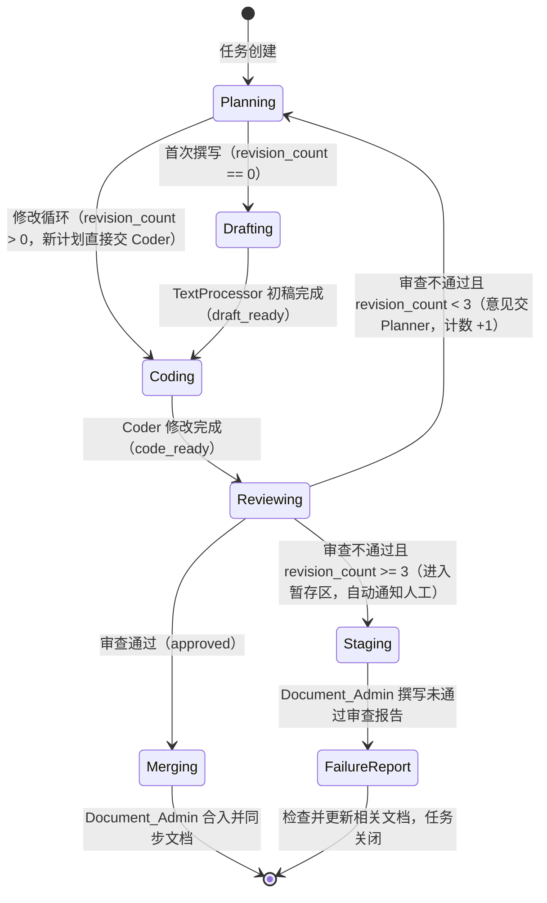
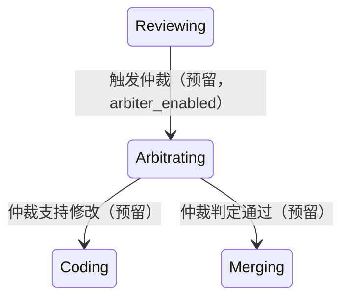
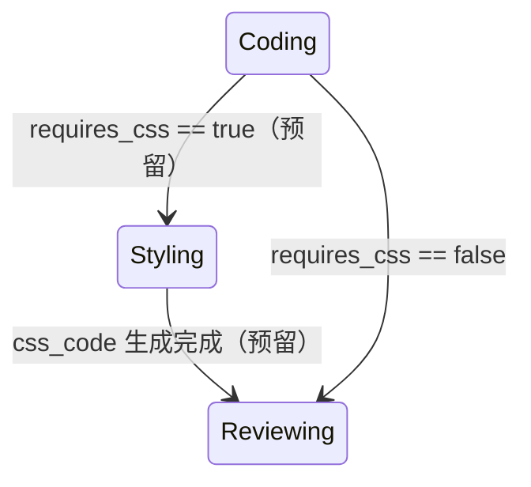

# RFC-001：CrewAI Flow 工作流设计——文本处理员先行撰写文档与审查修改循环

## 元数据

| 字段 | 内容 |
| --- | --- |
| 文档编号 | RFC-001 |
| 标题 | CrewAI Flow 工作流设计：文本处理员先行撰写文档与审查修改循环 |
| 项目 | `my_first_crew`（Revachol CrewAI 项目） |
| 作者 | Revachol AI 工作流架构组 |
| 创建日期 | 2026-08-24 |
| 状态 | 草案（Draft） |
| 版本 | 0.2.0 |
| 关联文件 | `run_revachol_crew.py`、`crew.jsonc`、`agents/*.jsonc`、`backend/routes/crew.cjs`、`knowledge/docs/` |
| 评审对象 | 全体开发成员、产品负责人、AI 工作流维护者 |

### 修订记录

| 版本 | 日期 | 变更说明 |
| --- | --- | --- |
| 0.1.0 | 2026-08-24 | 初稿。 |
| 0.2.0 | 2026-08-24 | 依评审决议修订：① 确认 TextProcessor 仅首次撰写初稿、修改循环由 Coder 直接修改；② 循环语义改为“总计最多 3 次审查”；③ 暂存快照保留 30 天；④ 进入暂存区自动通知人工；⑤ GPT-4 仲裁者触发策略默认 `on_dispute`；⑥ GPT-4 与 Doubao 列为未来项、不在本期实施；⑦ 支持流程中断后恢复；⑧ 补充合入标准量化建议与灰度迁移策略。 |

## 摘要

本 RFC 提出在 `my_first_crew` 项目中以 CrewAI Flow 重构现有顺序执行流程，新增“文本处理员（TextProcessor）先行撰写文档初稿、修改循环由 Coder 直接修改”的工作线，并引入**总计最多 3 次审查**（初始审查 + 最多 2 轮修改循环）：Reviewer 不通过时，将修改意见交回 Planner，由 Planner 制定新计划后交给 Coder 修改。三次审查后仍无法合入的任务进入暂存区（保留 30 天并自动通知人工），由 Document_Admin 撰写未通过审查报告、检查并更新相关文档；GPT-4 仲裁者与豆包 CSS 生成列为未来项，不在本期实施。

## 已决议事项（v0.2.0）

| 编号 | 事项 | 决议 |
| --- | --- | --- |
| D1 | TextProcessor 参与范围 | 仅首次撰写文档初稿；修改循环由 Coder 直接修改 |
| D2 | 循环次数语义 | **总计最多 3 次审查**（初始审查 1 次 + 修改循环最多 2 轮） |
| D3 | 暂存快照保留时长 | 30 天，到期自动清理 |
| D4 | 进入暂存区后的动作 | 自动通知人工（Crew Dashboard 广播 + 事件日志，预留 webhook） |
| D5 | GPT-4 仲裁者触发策略 | 默认 `on_dispute`（未来项，本期不实施） |
| D6 | GPT-4 / Doubao 范围 | 列入未来项，**不在本次计划实施**，仅预留扩展点 |
| D7 | 中断恢复 | 支持流程中断后从最近快照恢复（断点续跑） |

## 动机 / 背景

### 现状

当前 `my_first_crew` 项目基于 CrewAI Crew 运行（`crew.jsonc` + `run_revachol_crew.py`），默认使用顺序（sequential）流程，并可通过 `--process hierarchical` 切换层级流程。现有四个 Agent 定义于 `agents/` 目录：

| Agent | 角色 | 当前模型 |
| --- | --- | --- |
| `_planner.jsonc` | 技术规划师（Planner） | deepseek-v4-pro |
| `_coder.jsonc` | 代码开发者（Coder） | deepseek-v4-flash |
| `_reviewer.jsonc` | 代码审查员（Reviewer） | kimi-k2.7-code |
| `_document_admin.jsonc` | 文档处理员（Document Admin） | mimo-v2.5 |

主脚本 `run_revachol_crew.py` 的文档字符串中已注明长期演进方向为“Flow-First 架构”，并规划 `pyproject.toml` 中 `[tool.crewai] type = "flow"`。项目路线图（`knowledge/docs/roadmap.md`）的“未来规划 → AI Agent”中亦已登记“状态图模式完善：Planner → Coder → Reviewer↺ 三次审查循环，未通过进入暂存区”的方向，本 RFC 即是对该方向的具体设计。

### 存在的问题

1. **缺少明确的“文档先行”环节**：当前没有独立的文本处理员（TextProcessor），文档撰写与代码修改职责混杂，文档质量不稳定，且难以与代码版本同步。
2. **审查—修改循环不可控**：Crew 的线性执行无法精确表达“审查不通过 → 返回修改”的受控循环；循环次数、终止条件与审计轨迹均不清晰，容易造成无限返工或任务静默失败。
3. **失败处理缺乏闭环**：审查多次不通过时，当前流程没有明确的“暂存区”“未通过审查报告”与“自动通知人工”机制，问题会被淹没在日志中，主工作线的稳定性无法得到制度性保障。
4. **缺少面向未来的扩展点**：没有为高成本“仲裁者”模型与专项“样式生成”模型预留清晰的接入位置（两者本期不实施，但设计上需留位）。

### 目标

- 在 Flow 中新增 **TextProcessor** 角色：由文本处理员**先行撰写文档初稿**，修改循环由 **Coder 直接修改**，形成清晰的“撰写—修改—审查”分工（D1）。
- 建立**总计最多 3 次审查**的循环：`Reviewer → Planner → Coder → Reviewer`，并显式维护循环计数（D2）。
- 三次审查后仍不通过的任务**进入暂存区**（保留 30 天，D3），**自动通知人工**（D4），由 Document_Admin 撰写未通过审查报告，并检查/更新相关文档，保障当前工作稳定。
- 状态机可观测、可持久化（支持中断后恢复，D7）、可测试；GPT-4 仲裁者与 Doubao 样式生成仅预留扩展点，本期不实施（D5、D6）。

### 非目标（本 RFC 不做）

- 不改造现有 Agent 的提示词细节（仅新增 TextProcessor 与必要的状态字段）。
- 不引入分布式任务队列或微服务拆分。
- 不改变现有 `knowledge/` 知识库的目录规范。
- **本期不实施** GPT-4 仲裁者与 Doubao 样式生成（仅在设计上预留扩展点，见“未来工作”）。

## 术语表

| 术语 | 说明 |
| --- | --- |
| Planner | 技术规划师，负责制定/修订任务计划 |
| TextProcessor | 文本处理员（新增），仅负责**首次**撰写文档初稿 |
| Coder | 代码开发者，负责按计划修改文档/编写代码（修改循环的执行者） |
| Reviewer | 代码审查员，负责按量化合入标准审查并给出结论（通过/不通过） |
| Document_Admin | 文档处理员，负责合入、文档同步、失败报告 |
| 合入标准 | Reviewer 判定“通过”必须满足的量化条件集合（硬性门禁 + 软性建议） |
| 暂存区 | 总计 3 次审查仍未通过的任务的快照存放位置，保留 30 天 |
| Arbiter | 未来项（本期不实施）：GPT-4 高成本仲裁模型 |
| Doubao | 未来项（本期不实施）：豆包模型，负责 CSS 等样式代码生成 |

## 设计方案

### 总体流程（状态图）



> 注：`revision_count` 为“累计审查不通过次数”。总计最多发生 **3 次审查判定**：初始审查 1 次 + 修改循环最多 2 轮（D2）。

### 状态节点说明

| 状态 | 参与者 | 职责 | 产出 |
| --- | --- | --- | --- |
| `Planning` | Planner | 将需求拆解为可执行计划；若携带 Reviewer 的修改意见，则制定**修订版计划** | `state.plan` |
| `Drafting` | TextProcessor（新增） | **仅首次**（`revision_count == 0`）依据计划撰写文档初稿 | `state.document` |
| `Coding` | Coder | 依据计划修改/完善文档，必要时产出代码或补丁；修改循环中**直接**承接 Planner 修订计划 | `state.document`（更新）、`state.code` |
| `Reviewing` | Reviewer | 依据量化合入标准审查，输出结构化结论（通过/不通过 + 意见） | `state.status`、`state.review_feedback`、`state.review_history` |
| `Merging` | Document_Admin | 将通过审查的文档/代码合入，检查并同步相关文档 | `state.status = merged` |
| `Staging` | 系统（Flow 路由） | 将未通过任务的文档、代码、审查历史快照写入暂存区（保留 30 天），并**自动通知人工** | `state.staging_area`、`state.notified_at` |
| `FailureReport` | Document_Admin | 撰写未通过审查报告，检查/更新相关文档，通知相关方 | `state.failure_report` |

### 转换条件

**1. 首次撰写 vs 修改循环（出自 `Planning`，决议 D1）**

- `revision_count == 0`：进入 `Drafting`，由 TextProcessor 先行撰写文档初稿。
- `revision_count > 0`：说明已进入修改循环，跳过 `Drafting`，新计划直接交给 `Coding`，由 Coder 修改文档。

**2. 合入标准（量化建议）**

Reviewer 按以下两层标准审查。**硬性门禁全部通过才可判定 `approved == true`**；软性建议作为加权项，不单独阻断合入。

| 层级 | 检查项 | 量化标准 | 执行方式 |
| --- | --- | --- | --- |
| 硬性 | 逻辑与计划一致性 | Reviewer 按 `plan` 逐项核对，无未解决的偏差项 | Reviewer checklist |
| 硬性 | 单元测试 | 相关单元测试全部通过；新增/修改逻辑语句覆盖率 ≥ 80% | 前端：`npx vitest run`、`npm run test:coverage`；Python 侧：Flow 路由测试（pytest）全通过 |
| 硬性 | 静态检查与格式 | ESLint 无 error、Prettier 检查通过；Python 配置/脚本 dry-run 通过 | `npx eslint js/**/*.js`、`npx prettier --check`、`python run_revachol_crew.py --dry-run` |
| 硬性 | 构建 | 涉及前端资源时生产构建成功 | `npm run build` |
| 硬性 | 安全 | 无新增高危依赖告警（high/critical 为 0） | `npm audit`（Python 依赖无已知高危 CVE） |
| 硬性 | 文档同步 | `module-index.md` 与 `knowledge/docs/` 相关文档已同步（涉及接口/模块变更时） | Document_Admin 检查 |
| 软性 | E2E 冒烟 | 涉及 UI 交互时 Playwright 冒烟通过 | `npm run test:e2e` |
| 软性 | 代码风格 | 符合 `docs/development/code-style.md`（事件命名 `域:动作`、无模块内独立版本号、ESM 带 `.js` 后缀） | Reviewer 人工核对 |
| 软性 | 成本可观测 | `crew:stats` 事件正常落库（Token 消耗可回溯） | Crew Dashboard |

Reviewer 输出结构（沿用项目“Prompt 约束 + 后处理校验”约定，见 CHANGELOG v1.19 对 DeepSeek `response_format` 不兼容的说明）：

```json
{
  "approved": true,
  "checklist": { "logic": true, "tests": true, "lint": true, "build": true, "security": true, "docs": true },
  "feedback": "具体、可执行的修改意见（不通过时必填）",
  "confidence": 0.92
}
```

**3. 审查结论与循环次数（总计最多 3 次审查，决议 D2）**

- `max_review_rounds = 3`：总计最多审查判定次数（**含初始审查**）。
- `max_revisions = 2`：初始审查之后最多允许的修改循环轮数（`= max_review_rounds - 1`）。
- 路由规则：`approved == true` → `Merging`；`approved == false` → `revision_count += 1`，若 `revision_count < 3` 返回 `Planning`，否则进入 `Staging`。

| 审查轮次 | 结果 | revision_count 变化 | 去向 |
| --- | --- | --- | --- |
| 第 1 次（初始审查） | 不通过 | 0 → 1 | `1 < 3`，回 `Planning`（Coder 直接修改） |
| 第 2 次审查 | 不通过 | 1 → 2 | `2 < 3`，回 `Planning` |
| 第 3 次审查 | 不通过 | 2 → 3 | `3 >= 3`，进入 `Staging` |

> 说明：修改循环 `Reviewer → Planner → Coder → Reviewer` 最多执行 **2 轮**；总计最多发生 **3 次审查判定**。TextProcessor 仅在第 1 次撰写初稿（`revision_count == 0`），修改循环由 Coder 直接修改（D1）。

**4. 暂存区（Staging：保留 30 天 + 自动通知人工，决议 D3/D4）**

- 将 `document`、`code`、`plan`、`review_history`、`review_feedback` 快照写入 `output/staging/<task_id>/`。
- `state.status = staged`，主工作线（main line）不被污染，保障当前工作稳定。
- `state.retention_days = 30`：清理任务（后端定时任务或系统 cron）每日扫描并删除超过 30 天的暂存快照。
- **自动通知人工**：进入暂存区时，通过 Crew Dashboard WebSocket 广播（复用 `CREW_*` 事件或新增 `FLOW_STAGED` 事件）并写入事件日志；`state.notify_channel` 预留 webhook（企业微信/飞书）通道。
- 随后自动流转至 `FailureReport`，由 Document_Admin 处理。

**5. 未通过审查报告（FailureReport）**

Document_Admin 需要完成：

1. 撰写《未通过审查报告》，内容至少包含：任务 ID、需求摘要、最多 3 轮审查意见汇总、最终未通过原因、建议后续动作（人工介入/等待仲裁/关闭任务）；
2. 检查知识库中与该任务相关的文档是否需要更新（例如将文档标记为“待修订”或补充已知问题）；
3. 更新 `knowledge/docs/` 下的相关索引或状态说明，保证文档与任务状态一致。

### 参与者职责与角色关系

| 参与者 | 类型 | 职责 | 备注 |
| --- | --- | --- | --- |
| Planner | 既有 Agent | 制定计划；消化审查意见并制定修订计划 | 模型：deepseek-v4-pro |
| TextProcessor | **新增 Agent** | **仅首次**撰写文档初稿（D1） | 建议模型：deepseek-v4-flash |
| Coder | 既有 Agent | 按计划修改文档、编写代码/补丁；**修改循环的直接执行者**（D1） | 模型：deepseek-v4-flash |
| Reviewer | 既有 Agent | 按量化合入标准审查，输出结构化结论与修改意见 | 模型：kimi-k2.7-code |
| Document_Admin | 既有 Agent | 合入通过项；撰写失败报告；检查/更新文档 | 模型：mimo-v2.5 |
| Arbiter（未来） | 预留（D6） | 审查僵持时的最终仲裁 | 建议模型：GPT-4；触发策略默认 `on_dispute`（D5） |
| StyleCoder（未来） | 预留（D6） | 生成 CSS 等样式代码 | 建议模型：Doubao（豆包） |

### 修改循环的时序视图

```mermaid
sequenceDiagram
    autonumber
    participant P as Planner
    participant T as TextProcessor
    participant C as Coder
    participant R as Reviewer
    participant D as Document_Admin
    participant H as 人工

    Note over P,T,C,R: 首次撰写（revision_count == 0）
    P->>T: 制定计划 plan
    T->>C: 撰写文档初稿 document
    C->>R: 修改后提交 code_ready
    R-->>R: 审查（第 1 次）

    alt 审查通过
        R->>D: approved，进入合入
        D-->>D: 合入并同步文档
    else 审查不通过（revision_count < 3）
        loop 最多 2 轮修改循环（总计 3 次审查）
            R->>P: 修改意见 review_feedback（revision_count + 1）
            P->>C: 修订版计划（跳过 Drafting，Coder 直接修改）
            C->>R: 重新提交
        end
        alt 仍不通过（revision_count >= 3）
            R->>D: 通知进入暂存区
            D->>H: 自动通知人工（Crew Dashboard / webhook）
            D-->>D: 撰写未通过审查报告并更新文档
        end
    end
```

## 技术选型

### 为什么选择 CrewAI Flow

1. **显式状态机**：Flow 的 `@start`、`@listen`、`@router` 装饰器天然适合表达“状态节点 + 带条件的转换”，能够精确实现本 RFC 的循环次数判断与暂存分支。
2. **受控循环**：与 Crew 内部不可控的 agent 重试不同，Flow 的循环发生在流程编排层，`revision_count` 作为显式状态字段，循环上界可验证、可测试、可审计。
3. **状态管理**：Flow 基于 Pydantic 的 `FlowState` 统一管理 `plan`、`document`、`review_feedback`、`revision_count`、`status` 等字段，类型安全且可持久化。
4. **与现有资产兼容**：现有 `agents/*.jsonc` 与 Crew 定义可以直接被 Flow 中的各步骤复用，迁移成本低。
5. **官方推荐方向**：项目主脚本中已注明“Flow-First 架构”的长期演进方向；CrewAI 官方同样推荐生产级项目采用 Flow 编排多 Crew 协作。
6. **可观测与可测试**：Flow 支持 `flow.plot()` 生成状态图、支持按方法级 mock 做单元测试，便于验证 `revision_count` 为 0/1/2/3 时的路由行为。
7. **版本现状兼容**：当前环境 crewai 1.15.17 已内置 `crewai.flow`（`@start/@listen/@router`）模块，**无需强制升级**即可实施；路线图中“评估 1.16+ Flows”继续保留为独立探索项，不阻塞本期实施。
8. **断点续跑可落地**：Flow 状态为纯数据对象，可在每次状态转换后落盘快照，支持中断后从最近快照恢复（D7）；项目根已有 `checkpoints.db`，可与 CrewAI 持久化方案共用。

### 对 GPT-4 仲裁者的可扩展性（未来项，本期不实施，D5/D6）

- **预留状态**：在 `Reviewing` 与 `Merging`/`Staging` 之间预留 `Arbitrating` 状态。**触发策略默认 `on_dispute`**（D5），即 Reviewer 与 Coder 对结论存在分歧时才调用；亦可扩展为 `at_revision_2`（第 3 次审查前提前介入）或 `low_confidence`。
- **成本控制**：仲裁者仅在满足触发条件时被调用，高成本模型（GPT-4）不参与常规循环；建议每任务最多调用 1 次。
- **本期不实施**：本期 `FlowStatus` 与 `FlowState` **不包含**仲裁相关字段，实施时再新增 `Arbitrating` 状态与 `arbiter_enabled`、`arbiter_trigger_policy`、`arbiter_decision`、`arbiter_used` 字段。

未来状态图演进（预留，本期不实施）：



### 对豆包（Doubao）CSS 生成的可扩展性（未来项，本期不实施，D6）

- **独立旁路**：预留可选状态 `Styling`（或独立 `StyleCrew`），由 `@router` 依据 `requires_css` 判断是否进入；样式生成不阻塞主审查循环。
- **模型绑定**：`StyleCrew` 的 Agent 配置 `llm` 指向豆包模型（如 `doubao/...`），与主链路模型解耦，未来切换模型只需改配置。
- **本期不实施**：本期 `FlowStatus` 与 `FlowState` **不包含**样式相关字段，实施时再新增 `requires_css`、`css_code`、`styled_by` 字段。

未来样式旁路示意（预留，本期不实施）：



### 灰度迁移策略（建议）

结合项目现状（单分支 `main` + WIP 版本管理 + 后端经 `backend/routes/crew.cjs` 以 `child_process.spawn` 调用 Python 脚本 + Crew Dashboard WebSocket 事件体系），建议采用“**双入口 + 影子运行 + 环境开关 + 一键回滚**”四步灰度：

**第 1 步：双入口并存**
- 新增 `run_revachol_flow.py`（Flow 入口，复用 `--once --json-logs` 事件流约定），保留 `run_revachol_crew.py`（旧 Crew 入口）。
- 后端 `POST /api/crew/run` 增加 `engine` 参数（`crew` | `flow`，默认 `crew`）；Crew Dashboard 显示当前引擎徽标。

**第 2 步：影子运行（shadow）**
- 新增 `engine=shadow`：同一需求同时跑 Crew 与 Flow，产出对比（`document`/`code` 差异、审查轮次、最终结论）写入 `output/shadow/<task_id>/`（保留 30 天），以 Flow 结果为准还是以 Crew 结果为准可配置，默认不影响主流程结果。
- 采集至少 20 个真实需求样本后人工复核差异。

**第 3 步：环境开关灰度**
- 通过环境变量 `CREW_ENGINE`（`.env` / Docker Compose 注入，遵循项目环境变量统一管理约定）控制默认引擎；Python 侧支持 `--engine` 参数覆盖。
- 先在个人/开发环境切 `flow` 观察 1–2 周无回归，再将后端默认值切为 `flow`。

**第 4 步：验收与回滚**
- 验收 KPI：
  - 循环终止率 **100%**（无死循环、无悬挂任务）；
  - 平均审查轮次 **≤ 2**（即多数任务在 3 次审查内合入）；
  - 暂存区自动通知人工触达率 **100%**；30 天清理任务执行无异常；
  - 中断恢复测试 **100%** 通过（从 `Planning`/`Reviewing`/`Staging` 断点续跑）；
  - Flow 事件与 Crew Dashboard 兼容（`CREW_*` 事件可被现有前端消费）；
  - 影子运行样本中 Crew 与 Flow 结论一致率 **≥ 95%**（差异均经人工复核）。
- 任一 KPI 不达标或出现 P0 问题：将 `CREW_ENGINE` 改回 `crew` 即完成回滚；暂存快照（30 天）可用于重放任务。
- 按项目版本规范（`docs/architecture/version-manage.md`）：切换期间提交以 `WIP` 标记，README 更新日志登记；切换完成后将 `docs/roadmap.md` 中“状态图模式完善”标记为已完成，并同步 `docs/development/module-index.md`。

## 数据模型

### FlowState（Pydantic）

```python
from __future__ import annotations

from datetime import datetime
from enum import Enum
from typing import Any, Optional

from pydantic import BaseModel, Field


class FlowStatus(str, Enum):
    """工作流状态枚举（本期不包含仲裁/样式状态，见未来工作）。"""
    PLANNING = "planning"          # 计划制定中
    DRAFTING = "drafting"          # 文本处理员撰写初稿中（仅首次）
    CODING = "coding"              # Coder 修改中
    REVIEWING = "reviewing"        # Reviewer 审查中
    MERGED = "merged"              # 已合入
    STAGED = "staged"              # 已进入暂存区
    FAILED = "failed"              # 已出未通过审查报告，任务关闭


class ReviewLoopState(BaseModel):
    """文档撰写 + 审查修改循环的 Flow 状态。"""

    # 任务标识
    task_id: str = Field(default_factory=lambda: datetime.now().strftime("%Y%m%d%H%M%S"))
    requirement: str = ""                          # 原始需求描述

    # 各阶段产物
    plan: str = ""                                 # Planner 产出（初始/修订版）
    document: str = ""                             # TextProcessor 初稿 / Coder 修改后的文档
    code: str = ""                                 # Coder 产出的代码或补丁
    review_feedback: str = ""                      # Reviewer 最近一次修改意见

    # 循环控制（决议 D2：总计最多 3 次审查）
    revision_count: int = 0                        # 累计审查不通过次数（0..3）
    max_review_rounds: int = 3                     # 总计最多审查轮数（含初始审查）
    max_revisions: int = 2                         # 修改循环上限 = max_review_rounds - 1
    status: FlowStatus = FlowStatus.PLANNING       # 当前状态
    review_history: list[dict[str, Any]] = []      # 审查历史（结论、意见、时间戳）

    # 暂存与失败闭环（决议 D3/D4）
    staging_area: Optional[str] = None             # 暂存区路径，如 output/staging/<task_id>
    retention_days: int = 30                       # 暂存快照保留时长（天）
    notified_at: Optional[str] = None              # 自动通知人工时间（ISO 8601）
    notify_channel: str = "crew-dashboard"         # 通知渠道：crew-dashboard / webhook
    failure_report: Optional[str] = None           # 未通过审查报告路径或内容

    # 审计
    created_at: str = Field(default_factory=lambda: datetime.now().isoformat())
    updated_at: str = Field(default_factory=lambda: datetime.now().isoformat())
```

### 字段说明

| 字段 | 类型 | 说明 |
| --- | --- | --- |
| `task_id` | str | 任务唯一标识，同时用于暂存区目录命名 |
| `requirement` | str | 原始需求，全流程只读输入 |
| `plan` | str | Planner 产出的计划；修改循环中被修订版覆盖 |
| `document` | str | 文档主体；首次由 TextProcessor 撰写，之后由 Coder 修改 |
| `code` | str | Coder 产出的代码/补丁（可为空） |
| `review_feedback` | str | Reviewer 不通过时给出的修改意见 |
| `revision_count` | int | **累计审查不通过次数**（0..3），路由判断的核心依据 |
| `max_review_rounds` | int | **总计最多审查轮数（含初始审查），默认 3**（D2） |
| `max_revisions` | int | 修改循环上限（`= max_review_rounds - 1`，默认 2） |
| `status` | FlowStatus | 状态机当前状态 |
| `review_history` | list[dict] | 每次审查的结构化记录（结论、意见、时间戳） |
| `staging_area` | Optional[str] | 暂存区路径，第 3 次审查仍不通过时写入 |
| `retention_days` | int | 暂存快照保留时长，默认 30 天（D3） |
| `notified_at` | Optional[str] | 自动通知人工时间（D4） |
| `notify_channel` | str | 通知渠道，默认 `crew-dashboard`，预留 `webhook`（D4） |
| `failure_report` | Optional[str] | Document_Admin 产出的未通过审查报告 |
| `created_at` / `updated_at` | str | 审计时间戳 |

### 路由条件（伪代码）

```python
from crewai.flow.flow import Flow, listen, router, start


class DocumentReviewFlow(Flow[ReviewLoopState]):

    @start()
    def planning(self):
        """Planner：制定计划或修订计划。"""
        # 首次：planner 按 requirement 制定计划
        # 循环：planner 结合 review_feedback 制定修订计划
        self.state.status = FlowStatus.PLANNING

    @router(planning)
    def route_after_planning(self):
        if self.state.revision_count == 0:
            return "drafting"    # 首次：文本处理员先行撰写（D1）
        return "coding"          # 修改循环：直接交 Coder（D1）

    @listen("drafting")
    def drafting(self):
        """TextProcessor：仅首次撰写文档初稿。"""
        self.state.status = FlowStatus.DRAFTING

    @listen("drafting")
    def coding(self):
        """Coder：修改/完善文档。"""
        self.state.status = FlowStatus.CODING

    @listen("coding")
    def reviewing(self):
        """Reviewer：按量化合入标准审查，写回 status 与 review_feedback。"""
        self.state.status = FlowStatus.REVIEWING

    @router(reviewing)
    def route_after_review(self):
        if self.state.status == FlowStatus.MERGED:      # 审查通过
            return "merging"
        self.state.revision_count += 1                  # 累计一次“不通过”
        if self.state.revision_count < self.state.max_review_rounds:  # < 3
            return "planning"                           # 继续修改循环（最多 2 轮）
        return "staging"                                # 第 3 次仍不通过 → 暂存

    @listen("merging")
    def merging(self):
        """Document_Admin：合入并同步文档。"""

    @listen("staging")
    def staging(self):
        """系统：写入暂存区快照 + 自动通知人工 + 安排 30 天清理。"""
        self.state.status = FlowStatus.STAGED
        self.state.staging_area = f"output/staging/{self.state.task_id}"
        self._write_snapshot(self.state.staging_area)                       # 快照落盘
        self._notify_human(channel=self.state.notify_channel)               # D4 自动通知人工
        self._schedule_cleanup(days=self.state.retention_days)              # D3 保留 30 天

    @listen("staging")
    def failure_report(self):
        """Document_Admin：撰写未通过审查报告并更新文档。"""
        self.state.status = FlowStatus.FAILED
```

> **断点续跑（D7）**：每个状态转换完成后，将 `ReviewLoopState` 快照写入 `output/flow_state/<task_id>.json`（或启用 CrewAI 持久化，复用项目根已有的 `checkpoints.db`）。中断后 `resume(task_id)` 读取最近快照恢复状态，从对应状态方法继续执行；`Staging`/`FailureReport` 等长耗时步骤需保证幂等（重复执行不产生重复快照/重复通知）。

## 实现清单（可执行步骤）

1. **新增 Agent 配置**：创建 `agents/_text_processor.jsonc`，角色“文本处理员 (TextProcessor)”，目标为“依据 Planner 计划先行撰写结构完整、内容准确的文档初稿（仅首次，不参与修改循环）”，建议模型 deepseek-v4-flash，工具 `["FileReadTool", "FileWriterTool"]`。
2. **新增 Flow 文件**：创建 `flows/document_review_flow.py`，实现 `ReviewLoopState` + `DocumentReviewFlow`（含路由与断点续跑）。
3. **接入现有 Crew**：将 `planner/coder/reviewer/document_admin` 四个既有 Agent 作为 Flow 步骤的执行单元；`agents/*.jsonc` 基本不变。
4. **路由与状态测试**：对 `route_after_review` 编写 pytest 单元测试，覆盖 `revision_count` 为 0/1/2/3 的全部分支与 `max_review_rounds` 边界。
5. **暂存区落地**：创建 `output/staging/` 目录；`staging` 步骤写入 `plan/document/code/review_history/review_feedback` 的 JSON 快照；实现 30 天保留与每日清理任务（D3）。
6. **自动通知人工**：进入暂存区时广播 Crew Dashboard 事件（`FLOW_STAGED`）并写事件日志；预留 webhook 通道与 `notify_channel` 配置（D4）。
7. **断点续跑**：实现 `output/flow_state/<task_id>.json` 状态快照与 `resume(task_id)`；编写中断恢复测试（从 `Planning`/`Reviewing`/`Staging` 恢复，D7）。
8. **灰度迁移**：按“灰度迁移策略”执行——双入口（`run_revachol_flow.py`）→ 影子运行 → `CREW_ENGINE` 环境开关 → KPI 验收与回滚。
9. **文档同步**：更新 `knowledge/README.md`、`knowledge/docs/roadmap.md`（“状态图模式完善”标记完成）、`knowledge/docs/development/module-index.md` 与 CrewAI 使用文档。
10. **明确不实施**：GPT-4 仲裁者与 Doubao 样式生成本期不实施（D6），仅保留设计扩展点。

## 待议项 / 未来工作

### 未来工作一：GPT-4 仲裁者（本期不实施，D5/D6）

- 触发策略默认 `on_dispute`（D5）：Reviewer 与 Coder 对结论存在分歧时调用；可扩展 `at_revision_2`、`low_confidence`。
- 成本上限建议：每任务最多调用 1 次；仲裁结论是否可被人工否决，待实施时确认。
- 接入方式：新增 `Arbitrating` 状态与字段 `arbiter_enabled`、`arbiter_trigger_policy`、`arbiter_decision`、`arbiter_used`，仲裁结论改写路由目标（`Coding` 或 `Merging`）。

### 未来工作二：Doubao 样式生成（本期不实施，D6）

- 新增 `Styling` 状态（或独立 `StyleCrew`），`llm` 绑定豆包模型；字段 `requires_css`、`css_code`、`styled_by`。
- 待定：`Styling` 同步阻塞主链路还是异步旁路；样式代码是否纳入 Reviewer 审查范围。

### 其他待议项

1. **覆盖率门禁强度**：本 RFC 建议“新增/修改逻辑语句覆盖率 ≥ 80%”为硬性门禁，建议先试运行 2 周，视误伤率再决定是否降为软性建议。
2. **Reviewer 输出 Schema**：本 RFC 给出建议 JSON 结构；项目现约定为“Prompt 约束 + 后处理校验”（DeepSeek 不兼容 `response_format`），是否固化为独立校验函数待定。
3. **通知渠道**：默认 Crew Dashboard 广播；是否接入企业微信/飞书 webhook 需确认接收人与密钥管理方式。
4. **暂存快照归档**：30 天到期后直接删除，还是将报告部分归档至 `knowledge/`（默认建议直接删除，报告保留）。
5. **CrewAI 持久化方案选型**：优先评估官方持久化（1.15.17 能力范围内），否则使用自建 JSON 快照；两者需在实现前完成一次技术验证。

## 参考

- CrewAI Flow 官方文档：`https://docs.crewai.com/concepts/flows`
- 项目路线图：`knowledge/docs/roadmap.md`（“未来规划 → AI Agent → 状态图模式完善”）
- CrewAI 使用文档：`knowledge/docs/development/tools/crewai/quickstart.md`、`crewai-guide.md`
- 代码规范：`knowledge/docs/development/code-style.md`
- 版本规范：`knowledge/docs/architecture/version-manage.md`
- 架构总览：`knowledge/docs/architecture/README.md`
- 项目长期演进说明：`run_revachol_crew.py` 文件头“长期演进（官方推荐 Flow-First 架构）”注释
- 项目依赖版本：`requirements.txt`（crewai 1.15.17 / litellm 1.97.0）；前端脚本：根目录 `package.json`
